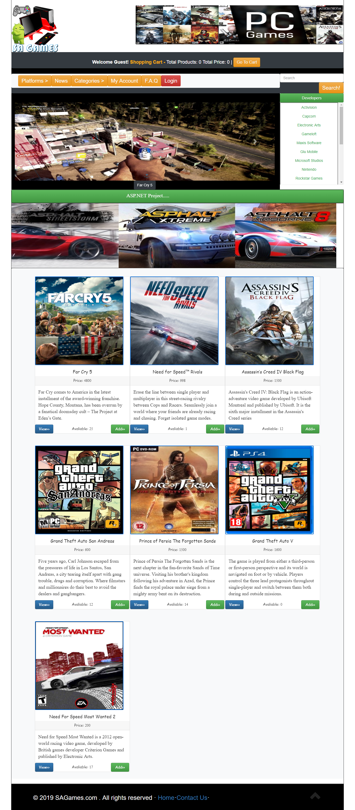

<h3>Overview:</h3>
An Online game Store and efficient easy-to-use Online platform for the sellers to sell the video games and the customers to purchase the same. Proper Interaction between the customers and the sellers through FAQ and Help Messages. Keeping Customers informed on the latest news and offer.
  
 
<h3> Platform:</h3> This websitee was designed and programmed using in Visual Studio 2017 using Asp.net .
 
 <figure>
 
<figcaption>Fig. - Online Game Store.</figcaption>
</figure>

<h4>Developed By :</h4>
<ul style="list-style-type:square">
<li>Sagor Ahamed</li>

<li>Nabil Ahmed</li>
<li>Md.Golam Rabbani Shuvo</li>
</ul>

<h4>FEATURES:</h4>
This website is embedded with various unique features. All of the features that are present within the software can be categorized into two portions:
<h6> User-side features</h6>
<ul style="list-style-type:circle">
<li>Viewing All products in Front-End Homepage.</li>
<li>Viewing All products in Front-End Homepage By Category / Platform / Developers.</li>
<li>Viewing Specific products by using Advanced Search.</li>
<li>Viewing each individual product with short description.</li>
<li>Adding product to cart direct from Front-End’s homepage or Individual Product Page’s.</li>
<li>Collection of all products in a cart.</li>
<li>Purchase via MasterCard.</li>
<li>Viewing & Editing User Profile Information.</li>
<li>Viewing Order Status.</li>
<li>Applying promo code and get discount on purchase.</li>
<li>Registration & Login.</li>
<li>View F.A.Q</li>
<li>Contact with Admin using help message.</li>
<li>View the news on the latest games and offers.</li>
<li>Suggestions for product in each product pages.</li>
<li>Forget Password Reset</li>
</ul>

<h6> Admin-side features</h6>
The admins may have access to the following features within the software:
<ul style="list-style-type:circle">
  
<li>Admin Panel With Menu.</li>
<li>Admin Login.</li>
<li>Inserting/ Viewing/ Deleting/ Updating Products.</li>
<li>Inserting/ Viewing/ Deleting/ Updating Category.</li>
<li>Inserting/ Viewing/ Deleting/ Updating Brands.</li>
<li>Inserting/ Viewing/ Deleting/ Updating Developers.</li>
<li>Inserting/ Viewing/ Deleting/ Updating Platforms.</li>
<li>Viewing Front-End Direct From Back-End.</li>
<li>Inserting/ Viewing/ Deleting/ Updating Products.</li>
<li>Inserting/ Viewing/ Deleting/ Updating Promo Code.</li>
<li>Inserting/ Viewing/ Deleting/ Updating F.A.Q.</li>
<li>Viewing/ Deleting/ Updating Customer Messages.</li>
<li>Viewing/ Deleting/ Updating Orders.</li>
<li>Replying To Customer Message.</li>
<li>Controlling The User Profile.</li>
<li>Updating News Feed, Header Image, Banner Image, Center Ads Image.</li>
</ul>
